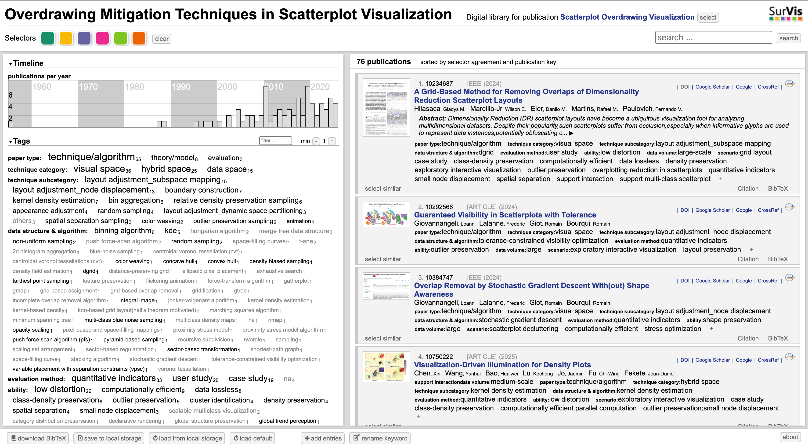

# Overdrawing-Mitigation-Techniques-in-Scatterplot-Visualization

This repository hosts an interactive literature browser for papers related to **Overdraw Mitigation in Scatterplot Visualization**. The website is built with **SurVis**, a browser-based visual literature collection system, and is deployed using **GitHub Pages**.

## Online Demo

## Preview

<p align="center">
  
</p>
Visit the project website here:

https://zhengyi-lyu.github.io/Overdrawing-Mitigation-Techniques-in-Scatterplot-Visualization/

## Project Purpose

Scatterplots are widely used to visualize multidimensional data, but overdraw and overplotting often occur when a large number of points are projected into a limited visual space. This project collects and organizes representative literature on techniques for mitigating scatterplot overdraw.

The goal of this repository is to provide an interactive literature map that supports browsing, filtering, searching, and comparing related studies.
## Main Topics

The collected literature focuses on topics such as:
- Scatterplot overdraw and overplotting mitigation
- Data-space methods, including sampling and data reduction
- Visual-space methods, including appearance adjustment, layout adjustment, and animation
- Hybrid-space methods that combine data abstraction and visual abstraction
- Evaluation methods for scatterplot visualization

## Repository Structure

```text
.
├── index.html              # Main website entry
├── about.html              # About page
├── properties.js           # SurVis configuration file
├── js/                     # JavaScript files for the SurVis interface
├── styles/                 # CSS stylesheets
├── fonts/                  # Font resources
└── data/                   # Literature data, generated files, images
